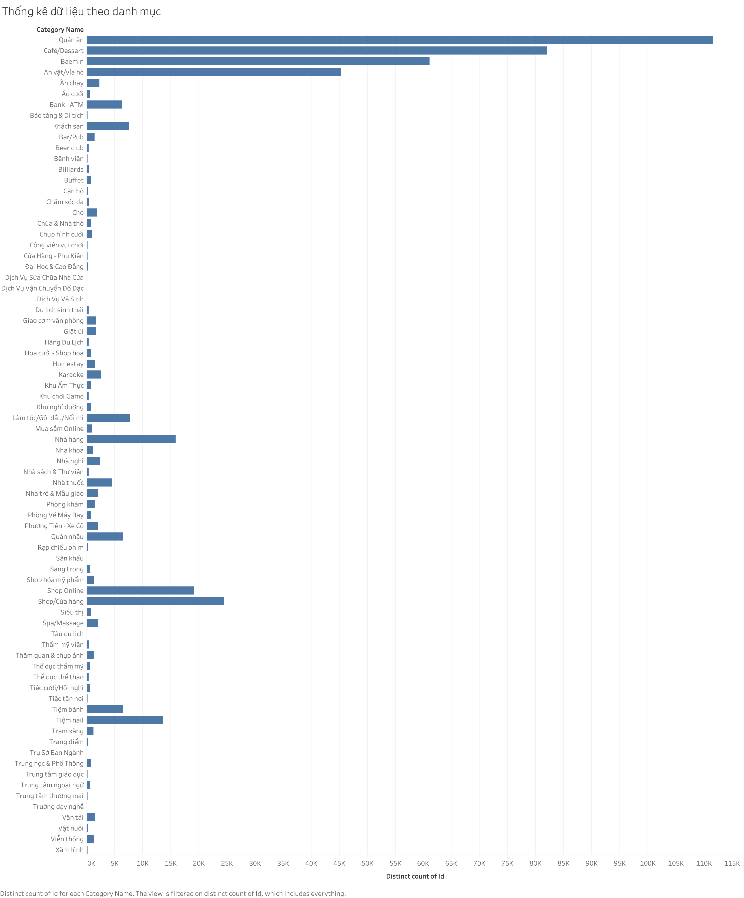

<p align="center" width="100%">
<a href="https://www.hcmus.edu.vn/" target="_blank"></a>
</p>

# Giới thiệu

Dự án này mang tên **Thu thập và xếp hạng các điểm nổi tiếng tại Việt Nam (POIs)** cũng là dự án thực tập tốt nghiệp thuộc chuyên ngành Khoa học máy tính, do nhóm các sinh viên trường Đại học Khoa học Tự Nhiên TPHCM thực hiện.

# Vietnamese POI: Dữ liệu các địa điểm đáng chú ý ở Việt Nam

[](https://github.com/tatsu-lab/stanford_alpaca/blob/main/LICENSE)
[](https://docs.google.com/forms/d/e/1FAIpQLSdecwG9Ug0TYgt2UF9_SiGTo4KfqK02L8-KquwvmrP3Fp_bdQ/viewform)
[](https://www.json.org/json-en.html)

**Note:** Nhóm thật sự cám ơn mọi người đã dành thời gian ghé vào repo này của nhóm. Thật mong chờ các phản hồi của mọi người và vui vẻ tiếp nhận nó !

**Vietnamese POI** là về dữ liệu về các địa điểm nổi bật trên toàn nước Việt Nam với dữ liệu. Chúng tôi đã tìm hiểu và thu thập trong vòng 3 tháng về các địa điểm nổi bật trên toàn nước Việt Nam.

Địa điểm được chia rõ ràng theo từng phân mục, từng tỉnh thành, quận huyện. Nó bao gồm không chỉ các địa điểm giải trí đơn thuần như: quán ăn, nhà hàng, khách sạn,... Mà còn có các địa điểm du lịch: danh lam thắng cảnh, bảo tàng lịch sử, ... Hay thậm chí là nhu cầu học tập như: nhà trẻ, trường học, ...

## Tổng quan

Ở đây là nơi để thích hợp để những người có hứng thú với dự án này có thể tìm hiểu sâu hơn về công dụng và mục tiêu của nó. Ngoài ra việc cài đặt , sử dụng sẽ trở nên dễ dàng hơn.

Để nhận được bộ dữ liệu vui lòng hoàn thành [biểu mẫu này](https://docs.google.com/forms/d/e/1FAIpQLSdecwG9Ug0TYgt2UF9_SiGTo4KfqK02L8-KquwvmrP3Fp_bdQ/viewform)

Chúng tôi cũng cung cấp sẵn các bộ dữ liệu cho mọi người. Bao gồm:

- Hơn [450K data](https://docs.google.com/forms/d/e/1FAIpQLSdecwG9Ug0TYgt2UF9_SiGTo4KfqK02L8-KquwvmrP3Fp_bdQ/viewform) địa điểm nổi bật ở Việt Nam (cập nhật mới nhất vào tháng **7/2023**)
- Trải dài khắp bản đồ Việt Nam
- Thuộc 75 danh mục khác nhau (Quán ăn, cây xăng, trường học, bãi biển,...) [xem tại đây](categories.json)
- [Dữ liệu mẫu](example_object.json)
```json
"Id": 1,
  "Location": {
    "Latitude": 10.631749,
    "Longitude": 106.736015,
    "Address": "491 Nguyễn Văn Tạo, X. Hiệp Phước",
    "District": "Huyện Nhà Bè",
    "DistrictId": 699,
    "DistrictUrl": "https://www.foody.vn/ho-chi-minh/khu-vuc-huyen-nha-be",
    "Location": "ho-chi-minh",
    "city": "Hồ Chí Minh"
  },
  "Name": "Dê Tươi Trường Khang - Dê Tươi - Nguyễn Văn Tạo",
  "CreatedAt": 1685357276,
  "Domain": [
    "foody",
    "baemin"
  ],
  "Cuisines": [
    {
      "Id": 54,
      "Name": "Đặc biệt",
      "NameEn": null,
      "ASCIIName": null,
      "DetailUrl": "https://www.foody.vn/ho-chi-minh/dia-diem-phong-cach-dac-biet"
    },
    {
      "Id": 55,
      "Name": "Đặc sản vùng",
      "NameEn": null,
      "ASCIIName": null,
      "DetailUrl": "https://www.foody.vn/ho-chi-minh/dia-diem-phong-cach-dac-san-vung"
    }
  ],
  "TotalReview": 0,
  "TotalView": 22,
  "TotalFavourite": 0,
  "TotalCheckins": 0,
  "AvgRating": "_._",
  "AvgRatingOriginal": 0,
  "ReviewUrl": "https://www.foody.vn/ho-chi-minh/de-tuoi-truong-khang-de-tuoi-nguyen-van-tao.h7hoym/binh-luan",
  "AlbumUrl": "https://www.foody.vn/ho-chi-minh/de-tuoi-truong-khang-de-tuoi-nguyen-van-tao.h7hoym/album-anh",
  "MainCategoryId": 3,
  "PictureCount": 0,
  "Status": 2,
  "HasBooking": false,
  "HasDelivery": true,
  "BookingUrl": "",
  "DeliveryUrl": "https://shopeefood.vn/ho-chi-minh/de-tuoi-truong-khang-de-tuoi-nguyen-van-tao.h7hoym",
  "BranchUrl": "https://www.foody.vn",
  "BranchName": "Hệ thống ",
  "TotalPictures": 0,
  "TotalSaves": 0,
  "IsOpening": true,
  "HasVideo": false,
  "Services": [
    {
      "Id": 1,
      "Type": 0,
      "Url": "https://www.foody.vn/ho-chi-minh/de-tuoi-truong-khang-de-tuoi-nguyen-van-tao.h7hoym/goi-mon",
      "Title": null,
      "Text": "Giao tận nơi",
      "Avatar": null,
      "Description": null
    }
  ],
  "Categories": [
    {
      "Id": 3,
      "Name": "Quán ăn",
      "NameEn": null,
      "ASCIIName": null,
      "DetailUrl": null
    }
  ],
  "BookingMobileUrl": "",
  "UrlRewriteName": "de-tuoi-truong-khang-de-tuoi-nguyen-van-tao.h7hoym",
  "PicturePath": "https://images.foody.vn/res/g100005/1000049373/prof/s180x180/file_93343ce0-8a03-4a62-935c-cef-73cb79ec-220316115331.jpeg",
  "PicturePathLarge": "https://images.foody.vn/res/g100005/1000049373/prof/s640x400/file_93343ce0-8a03-4a62-935c-cef-73cb79ec-220316115331.jpeg",
  "MobilePicturePath": "https://images.foody.vn/res/g100005/1000049373/prof/s640x400/file_93343ce0-8a03-4a62-935c-cef-73cb79ec-220316115331.jpeg",
  "DetailUrl": "https://www.foody.vn/ho-chi-minh/de-tuoi-truong-khang-de-tuoi-nguyen-van-tao.h7hoym",
  "ShowInSearchResult": false,
  "ImageUrl": "https://static.baemin.vn/CH/StoreList/061837-20220611/163dd51a-8bf9-4a87-8444-b86a23452784/store_main.jpg",
  "ThumbnailImageUrl": "https://static.baemin.vn/CH/StoreList/061837-20220611/163dd51a-8bf9-4a87-8444-b86a23452784/store_main-small.jpg",
  "Cuisine": "vietnamese",
  "FeaturedMenuTitle": {
    "en": "Recommended Menu",
    "vi": "Nhất định phải thử"
  },
  "RecommendMenu": "Lẩu dê",
  "IsAvailable": false,
  "State": "ACTIVE",
  "CanOrder": true,
  "IsPartner": false,
  "CanAcceptOrder": false,
  "AllowCashLessOrder": false,
  "ProvideDiscount": false,
  "ProvideCoupon": false,
  "CheckAvailability": 0,
  "Type": "MERCHANT",
  "DeliveryType": "1P_OWNFLEET_DH",
  "Rating": {
    "score": null,
    "reason": [],
    "totalrating": null,
    "totalorder": "0",
    "totallikes": null,
    "totaldislikes": null
  },
  "OpeningTime": {
    "Sunday": {
      "TimeOpen": "10:00",
      "TimeClose": "22:00"
    },
    "Monday": {
      "TimeOpen": "10:00",
      "TimeClose": "22:00"
    },
    "Tuesday": {
      "TimeOpen": "10:00",
      "TimeClose": "22:00"
    },
    "Wednesday": {
      "TimeOpen": "10:00",
      "TimeClose": "22:00"
    },
    "Thursday": {
      "TimeOpen": "10:00",
      "TimeClose": "22:00"
    },
    "Friday": {
      "TimeOpen": "10:00",
      "TimeClose": "22:00"
    },
    "Saturday": {
      "TimeOpen": "10:00",
      "TimeClose": "22:00"
    }
  }
```
## Dữ liệu thống kê

Thống kê dữ liệu chia Theo loại danh mục: [xem tại đây](poi_by_category.png)
<a href="poi_by_category.png" target="_blank"></a>

Thống kê dữ liệu chia theo khu vực: [xem tại đây](poi_by_city.png)
<a href="poi_by_city.png" target="_blank"></a>

